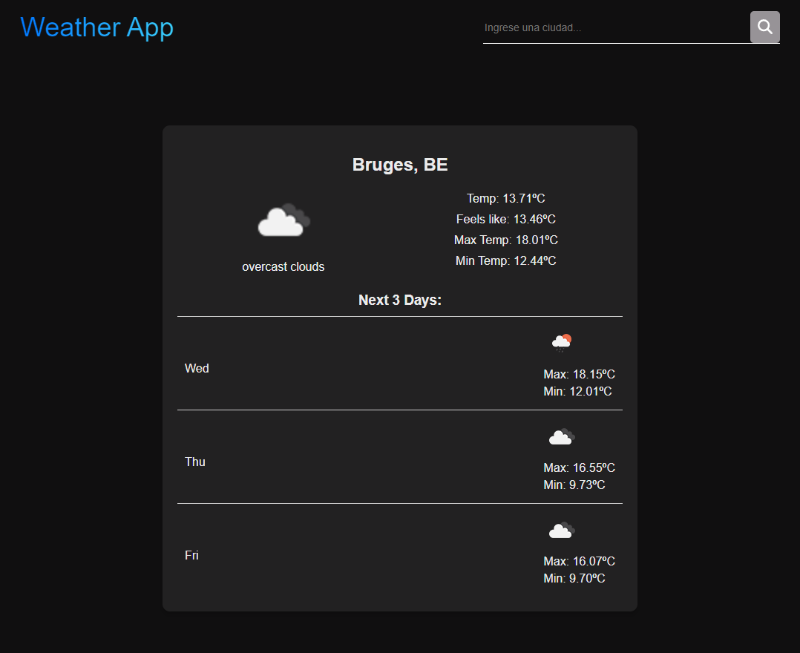

# Weather App



## Descripción

Esta es una aplicación meteorológica desarrollada con Vite y TypeScript que te permite obtener información meteorológica actual y pronósticos para cualquier ciudad del mundo.

La aplicación está diseñada con una arquitectura simple y un enfoque cuidadoso en la tipificación de datos, dada la amplia información proporcionada por la API de OpenWeatherMap.

## Características

- Obtención de datos meteorológicos actuales y pronósticos para cualquier ciudad.
- Interfaz intuitiva y fácil de usar.
- Integración con la API de OpenWeatherMap para datos precisos y actualizados.

## Instalación

1. Clona el repositorio a tu máquina local:

```
git clone https://github.com/tu-usuario/weather-app.git
```

2. Accede al directorio del proyecto:

```
cd weather-app
```

3. Instala las dependencias:

```
npm install
```

## Uso

1. Obtén una API Key de OpenWeatherMap registrándote en [OpenWeatherMap](https://home.openweathermap.org/users/sign_up).
2. Crea un archivo `.env` en la raíz del proyecto y agrega tu API Key:

```
VITE_OPENWEATHERMAP_API_KEY=your_api_key
```

3. Inicia la aplicación:

```
npm run dev
```

4. Abre tu navegador y ve a `http://localhost:3000`.

## Estructura del Proyecto

El proyecto sigue una estructura simple:

- `src/`: Contiene el código fuente de la aplicación.
  - `components/`: Componentes reutilizables de React.
  - `services/`: Funciones para interactuar con la API de OpenWeatherMap.
  - `types/`: Definiciones de tipos TypeScript para la aplicación.
  - `tests/`: Contiene las pruebas unitarias para la aplicación.
- `public/`: Archivos estáticos como imágenes y favicon.
- `vite.config.ts`: Configuración de Vite para el proyecto.
- `jest.config.ts`: Configuración de Jest para las pruebas unitarias.

## Tecnologías Utilizadas

- Vite: Para un rápido desarrollo y construcción.
- TypeScript: Para una tipificación segura y un código más robusto.
- React: Para la construcción de la interfaz de usuario.
- Axios: Para realizar solicitudes HTTP a la API de OpenWeatherMap.
- Jest: Para escribir pruebas unitarias.
- CSS Modules: Para estilos modulares y locales.
